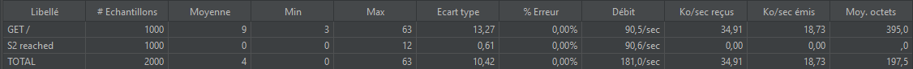

Auteurs: Robin GAUDIN, Lev POZNIAKOF, Axel VALLON

# AIT, Labo 3: Load balancing

## Task 1: Install the tools

> 1. Explain how the load balancer behaves when you open and refresh the URL [http://192.168.42.42](http://192.168.42.42/) in your browser. Add screenshots to complement your explanations. We expect that you take a deeper a look at session management.

Cette première capture montre le premier accès à localhost:80.


Cette seconde capture montre le 2e accès


Nous pouvons voir que le load balancer va faire alterner la connexion entre s1 et s2 équitablement. En effet, en rafraichissant plusieurs fois encore, il apparait que la charge est parfaitement répartie entre s1 et s2.

En ce qui concerne la gestion des sessions, nous pouvons constater que peu importe le nombre de rafraichissement, le champ sessionViews reste à 1. Ceci est dû au fait que les session n'ont pas été implémentée. De ce fait, les cookies envoyé par les 2 serveurs sont ignorés par le load-balancer. Les requêtes envoyée actuellement sont en HTTP qui est un protocole stateless. Sans cookies, impossibe d'identifier un client afin de maintenir une connexion

> 2. Explain what should be the correct behavior of the load balancer for session management.

Le comportement correct serait de toujours communiquer avec le même serveur lorsque la session est mise en place pour qu'à chaque rafraichissement nous conservions la session et pour que le sessionView s'incrémente.

> 3. Provide a sequence diagram to explain what is happening when one requests the URL for the first time and then refreshes the page. We want to see what is happening with the cookie. We want to see the sequence of messages exchanged (1) between the browser and HAProxy and (2) between HAProxy and the nodes S1 and S2. Here is an example:


> 4. Provide a screenshot of the summary report from JMeter.


> 5. Clear the results in JMeter and re-run the test plan. Explain what is happening when only one node remains active. Provide another sequence diagram using the same model as the previous one.



Le HA proxy ne pouvant pas atteindre le serveur s1 comme celui-ci est éteint, il renvoie l'intégralité des requêtes au s2 qui lui répond. Comme nous atteignons maintenant qu'un seul serveur, nous pouvons voir que si nous rafraichissons la page [localhost:80](localhost:80), le session view s'incrémente:


Indiquant que les sessions se mettent en place

**Diagramme de séquence:**


## Task 2: Sticky sessions

> 1. There is different way to implement the sticky session. One possibility is to use the SERVERID provided by HAProxy. Another way is to use the NODESESSID provided by the application. Briefly explain the difference between both approaches (provide a sequence diagram with cookies to show the difference).

**SERVERID:** Dans ce cas, le HAProxy ajoutera un nouveau cookie appelé SERVERID qui va préciser le serveur à utiliser 

**Diagramme de séquence avec SERVERID:**
````sequence
Browser->HAProxy: GET/
HAProxy->Server: GET/
Server->HAProxy: Set-Cookie: NODESESSID=hello
HAProxy->Browser: Set-Cookie: SERVERID=Server; NODESESSID=hello
Browser->HAProxy: GET/ Cookie: SERVERID=Server; NODESESSID=hello
HAProxy->Server: GET/ Cookie: NODESESSID=hello
Server->HAProxy: Set-Cookie: NODESESSID=hello
HAProxy->Browser: Set-Cookie: SERVERID=Server; NODESESSID=hello
````
**NODESESSID: ** Dans ce cas, il n'y aura pas de nouveau cookie mais les information relatives au serveur à choisir seront ajouté au début NODESESSID. Afin des séparer les informations du serveur et l'id de session, on sépare les 2 information avec un ``~``. Lorsque qu'on atteint le HAProxy, les informations du serveur sont retirés du cookie et on ne conserve donc que ce qu'il y a après le ``~``.

**Diagramme de séquence avec NODESESSID**
````sequence
Browser->HAProxy: GET/
HAProxy->Server: GET/
Server->HAProxy: Set-Cookie: NODESESSID=hello
HAProxy->Browser: Set-Cookie: NODESESSID=Server~hello
Browser->HAProxy: GET/ Cookie: NODESESSID=Server~hello
HAProxy->Server: GET/ Cookie: NODESESSID=hello
Server->HAProxy: Set-Cookie: NODESESSID=hello
HAProxy->Browser: Set-Cookie: NODESESSID=Server~hello
````

>2. Provide the modified `haproxy.cfg` file with a short explanation of the modifications you did to enable sticky session management.

````yaml
backend nodes
    [...]
    cookie SERVERID insert indirect nocache
    # Define the list of nodes to be in the balancing mechanism
    # http://cbonte.github.io/haproxy-dconv/2.2/configuration.html#4-server
    server s1 ${WEBAPP_1_IP}:3000 check cookie s1
    server s2 ${WEBAPP_2_IP}:3000 check cookie s2
````

Nous avons ajouté la ligne ``cookie ...`` et à la fin des lignes serveur, ``cookie s...``

La première ligne permet de signaler que nous voulons maintenant insérer un SERVERID dans le cookie.

L'ajout au bout des lignes serveur permet d'indiquer au serveur de faire la correspondance entre les données du cookie et le serveur à utiliser.

>3. Explain what is the behavior when you open and refresh the URL [http://192.168.42.42](http://192.168.42.42/) in your browser. Add screenshots to complement your explanations. We expect that you take a deeper a look at session management.

Maintenant que nous avons implémenté les sticky sessions, nous pouvons constater que le sessionViews s'incrémente:


 Lorsque nous nous connectons une première fois, nous nous connectons à un serveur, et lorsque nous rafraichissons, nous réaccédons à ce même serveur. 

Maintenant, si nous ouvrons une fenêtre de navigation privé et nous connectons à localhost aussi, nous pouvons voir que cette fois, ce n'est plus s2 mais s1 qui est contacté.


Et si nous rafraichissons, la sessionView s'incrémente également.

La session est donc correctement maintenue.

> 4. Provide a sequence diagram to explain what is happening when one requests the URL for the first time and then refreshes the page. We want to see what is happening with the cookie. We want to see the sequence of messages exchanged (1) between the browser and HAProxy and (2) between HAProxy and the nodes S1 and S2. We also want to see what is happening when a second browser is used.

````sequence
participant Browser 1 as B1
participant Browser 2 as B2
participant HAProxy
participant S1
participant S2
B1->HAProxy: GET/
HAProxy->S1: GET/
S1->HAProxy: Set-Cookie: NODESESSID=hello
HAProxy->B1: Set-Cookie: SERVERID=S1; NODESESSID=hello;
B2->HAProxy: GET/
HAProxy->S2: GET/
S2->HAProxy: Set-Cookie: NODESESSID=world
HAProxy->B1: Set-Cookie: SERVERID=S2; NODESESSID=world;
````

> 5. Provide a screenshot of JMeter's summary report. Is there a difference with this run and the run of Task 1?


Nous pouvons constater que seul un serveur (en l'occurence s2) qui est contacté. Ceci est dû au fait que la session est maintenue d'un GET à un autre et donc un seul serveur est contacté grâce au SERVER ID

> 6. Provide a screenshot of JMeter's summary report. Give a short explanation of what the load balancer is doing.


Nous pouvons constater que la charge est parfaitement répartie entre les 2 serveurs. 

Si nous allons consulter les requêtes maintenant:


Nous pouvons voir que le ``SERVERID`` est bien à s2 et que que le ``sessionViews`` à la fin de l'exécution est bien à 1000 (C'est aussi le cas pour les requête faites sur s1). C'est donc la preuve que les sticky session fonctionnent correctement.

## Task 3: Drain mode

> 1. Take a screenshot of the Step 5 and tell us which node is answering


Nous pouvons voir que le noeud qui répond est le 2. Le nombre de requête à 16 est cohérent puisque nous avons 16 rafraichissement (comme l'atteste la capture suivante).


> 2. Based on your previous answer, set the node in DRAIN mode. Take a screenshot of the HAProxy state page.

**Commande pour mettre s2 en DRAIN:**

````bash
set server nodes/s2 state drain
````


Les résultats de s1 ne sont pas à prendre en compte, nous avons ouvert d'autres navigateurs en avance pour tester le bon fonctionnement de la commande. 

Nous pouvons voir que s2 est bien passé en mode ``DRAIN``

>3. Refresh your browser and explain what is happening. Tell us if you stay on the same node or not. If yes, why? If no, why?

Si nous rafraîchissons le browser, nous pouvons constater que nous effectuons toujours la requête sur s2:


Ceci est dû au mode ``DRAIN`` qui redirige toutes les **nouvelles connexions** sur les autres nœuds mais maintien les connexions déjà existantes sur le nœud en mode drain (dans notre cas, s2).

> 4. Open another browser and open `http://192.168.42.42`. What is happening?


Nous pouvons voir que la connexion est envoyé vers s1. Si nous ouvrons un 3e navigateur:


nous pouvons voir que la connexion est aussi faite sur s1, prouvant le bon fonctionnement du mode ``DRAIN``.

> 5. Clear the cookies on the new browser and repeat these two steps multiple times. What is happening? Are you reaching the node in DRAIN mode?


Nous pouvons voir qu'une nouvelle session est ouverte car l'id n'est pas le même. Le serveur s2 n'est toujours pas atteint.

> 6. Reset the node in READY mode. Repeat the three previous steps and explain what is happening. Provide a screenshot of HAProxy's stats page.

**Commande pour passer l'état en ``READY``:**

````bash
set server nodes/s2 state ready
````

Nous rafraîchissons le premier browser:


La sessions est maintenue et nous restons sur s2

Nous rafraîchissons le 2e browser après la suppression des cookies:


Le serveur contacté est le s1 et une nouvelle session est créée.

Si nous supprimons une nouvelle fois les cookies:


Nous sommes connecté maintenant à s2 qui est de nouveau accessible.

Sur la page de statistiques nous avons le résultat suivant:


Indiquant que s2 est de nouveau accessible pout toutes les nouvelles connexions.

> 7. Finally, set the node in MAINT mode. Redo the three same steps and explain what is happening. Provide a screenshot of HAProxy's stats page.

**Commande pour passer l'état en ``MAINT``:**

````bash
set server nodes/s2 state MAINT
````

Sur le premier navigateur, après le passage en ``MAINT`` nous avons le résultat suivant:


Nous ne pouvons plus nous connecter à s2 et une nouvelle session est créée.

Sur le second navigateur, nous avons le même cas:


La page de statistique nous donne le résultat suivant:


Indiquant que s2 n'est plus accessible, les refresh n'incrément plus que les connexions à s1.

## Task 4: Round robin in degraded mode.

> 1. Make sure a delay of 0 milliseconds is set on `s1`. Do a run to have a baseline to compare with in the next experiments.


> 2. Set a delay of 250 milliseconds on `s1`. Relaunch a run with the JMeter script and explain what is happening.

> 3. Set a delay of 2500 milliseconds on `s1`. Same than previous step.

> 4. In the two previous steps, are there any errors? Why?

> 5. Update the HAProxy configuration to add a weight to your nodes. For that, add `weight [1-256]` where the value of weight is between the two values (inclusive). Set `s1` to 2 and `s2` to 1. Redo a run with a 250ms delay.

> 6. Now, what happens when the cookies are cleared between each request and the delay is set to 250ms? We expect just one or two sentence to summarize your observations of the behavior with/without cookies.
